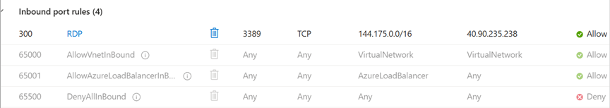

## Overview
This lab simulates a real-world sysadmin workflow using Microsoft Defender for Cloud to assess and improve the security posture of an Azure VM. It demonstrates secure deployment, NSG hardening, guest configuration, and compliance reporting — all within the free tier.

# Lab Goals
- Deploy a Windows Server VM with secure access
- Enable Defender for Cloud (CSPM)
- Review and remediate security recommendations
- Document results

## Components
- **Resource Group**: `SecurityLab-RG`
- **VM**: `SecurityLab-VM` (B1s, Windows Server 2022)
- **NSG**: RDP allowed only from my IP
- **Managed Identity**: Enabled for secure access
- **Storage Account**: For boot diagnostics
- **Defender for Cloud**: CSPM enabled (free tier)

## Screenshots
### 🔐 NSG Configuration

### 🧠 Secure Score Evaluation

### 🛠️ Guest Configuration Extension

### 🛡️ Microsoft Defender Recommendations

## 📊 Results

- No critical or high-risk recommendations
- Secure Score initially 0% due to pending evaluations
- 22 of 24 posture items marked “Not evaluated” at time of scan
- VM confirmed to be secure at baseline with free-tier tools

> ⚠️ Note: The Secure Score shows 0% because most posture checks were still pending evaluation at the time of capture. This is expected behavior shortly after enabling Guest Configuration and diagnostic settings. Paid Defender plans were intentionally skipped to maintain free-tier compliance, which also limits posture visibility.

